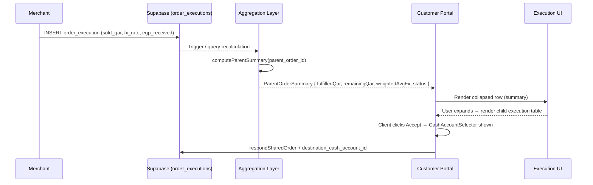
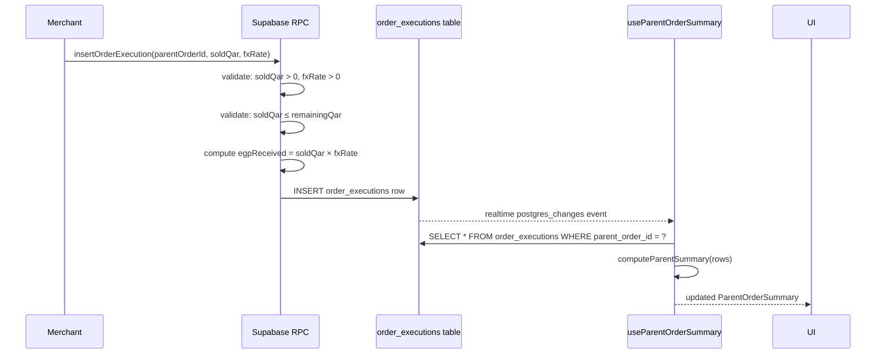
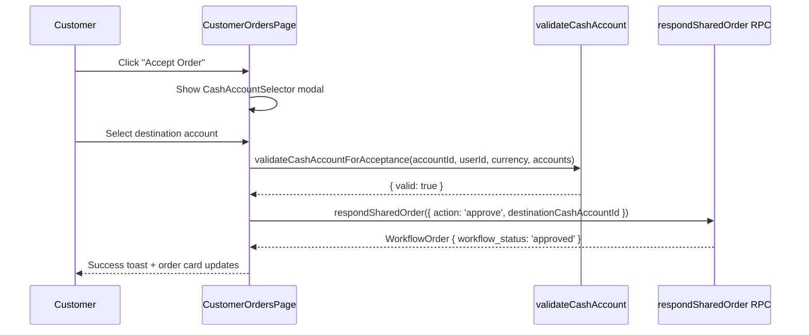
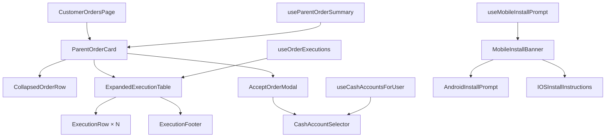

# Design Document: Parent Order Fulfillment with Child Executions

## Overview

A parent order (e.g. 50,000 QAR) is fulfilled through one or more sell executions, each potentially at a different FX rate. The system derives a weighted average FX rate from all completed child executions, tracks fulfillment progress, enforces overfill prevention, and surfaces a collapsed/expanded UI in the customer portal. Acceptance of an order requires the client to select a destination cash account. The client portal inherits merchant cash management logic in a read-only, scoped manner. The mobile app enforces installation prompts when running in a browser on a mobile device.

All new behavior is additive. No existing pricing engine, settlement engine, merchant portal, ledger posting, or accounting rule is modified.

---

## Main Algorithm / Workflow



---

## Core Interfaces / Types

```typescript
// ── Phase 1: Child Execution ──────────────────────────────────────────

export type ExecutionStatus = 'completed' | 'pending' | 'cancelled' | 'failed';
export type MarketType = 'instapay_v1' | 'p2p' | 'bank' | 'manual';

export interface OrderExecution {
  id: string;
  parent_order_id: string;
  sequence_number: number;
  sold_qar_amount: number;          // > 0
  fx_rate_qar_to_egp: number;       // > 0
  egp_received_amount: number;      // = sold_qar_amount × fx_rate_qar_to_egp
  market_type: MarketType;
  cash_account_id: string | null;
  status: ExecutionStatus;
  executed_at: string;              // ISO timestamp
  created_by: string;               // user_id
  created_at: string;
  updated_at: string;
}

// ── Phase 2: Parent Order Aggregation ────────────────────────────────

export type FulfillmentStatus =
  | 'unfulfilled'       // fulfilledQar === 0
  | 'partially_fulfilled' // 0 < fulfilledQar < parentQar
  | 'fully_fulfilled';  // fulfilledQar === parentQar

export interface ParentOrderSummary {
  parent_order_id: string;
  parent_qar_amount: number;
  fulfilled_qar: number;
  remaining_qar: number;
  total_egp_received: number;
  fill_count: number;
  progress_percent: number;         // 0–100
  weighted_avg_fx: number | null;   // null when fill_count === 0
  fulfillment_status: FulfillmentStatus;
  executions: OrderExecution[];     // child rows, ordered by sequence_number
}

// ── Phase 4: Cash Destination on Acceptance ──────────────────────────

export interface OrderAcceptancePayload {
  order_id: string;
  actor_role: 'customer';
  action: 'approve';
  destination_cash_account_id: string; // required, non-null
}

export interface CashAccountValidationResult {
  valid: boolean;
  reason?: 'no_account_selected' | 'wrong_owner' | 'currency_mismatch' | 'account_disabled';
}

// ── Phase 6: Mobile Install Prompt ───────────────────────────────────

export type InstallPromptState =
  | 'not_applicable'   // already installed or native app
  | 'pending'          // should show prompt
  | 'dismissed';       // user dismissed, suppress for session

export interface MobileInstallContext {
  isMobileBrowser: boolean;
  isInstalled: boolean;
  platform: 'android' | 'ios' | 'other';
  promptState: InstallPromptState;
  nativePromptAvailable: boolean;   // Android BeforeInstallPromptEvent captured
}
```

---

## Key Functions with Formal Specifications

### `computeParentSummary(parentOrderId, executions)`

```typescript
function computeParentSummary(
  parentQarAmount: number,
  executions: OrderExecution[],
): ParentOrderSummary
```

**Preconditions:**
- `parentQarAmount > 0`
- All executions in the array have `parent_order_id` matching the parent
- Each execution with `status === 'completed'` satisfies `sold_qar_amount > 0` and `fx_rate_qar_to_egp > 0`
- `SUM(completed sold_qar_amount) <= parentQarAmount` (overfill impossible by DB constraint)

**Postconditions:**
- `fulfilled_qar = SUM(e.sold_qar_amount for e where e.status === 'completed')`
- `remaining_qar = parentQarAmount − fulfilled_qar`
- `total_egp_received = SUM(e.egp_received_amount for e where e.status === 'completed')`
- `fill_count = COUNT(e where e.status === 'completed')`
- `progress_percent = (fulfilled_qar / parentQarAmount) * 100`
- `weighted_avg_fx = fill_count > 0 ? total_egp_received / fulfilled_qar : null`
- `fulfillment_status` follows the three-way mapping (unfulfilled / partially / fully)
- `remaining_qar >= 0` always
- `progress_percent` is in `[0, 100]`

**Loop Invariants (over executions array):**
- After processing k executions: `running_fulfilled <= parentQarAmount`
- `running_egp = SUM(e.egp_received_amount for first k completed executions)`

---

### `validateExecutionInsert(execution, parentOrder, existingSummary)`

```typescript
function validateExecutionInsert(
  execution: Omit<OrderExecution, 'id' | 'created_at' | 'updated_at'>,
  parentQarAmount: number,
  currentFulfilledQar: number,
): { valid: boolean; reason?: string }
```

**Preconditions:**
- `execution.sold_qar_amount` is provided
- `execution.fx_rate_qar_to_egp` is provided
- `parentQarAmount > 0`
- `currentFulfilledQar >= 0`

**Postconditions:**
- Returns `{ valid: false, reason: 'amount_exceeds_remaining' }` if `execution.sold_qar_amount > (parentQarAmount − currentFulfilledQar)`
- Returns `{ valid: false, reason: 'invalid_amount' }` if `execution.sold_qar_amount <= 0`
- Returns `{ valid: false, reason: 'invalid_rate' }` if `execution.fx_rate_qar_to_egp <= 0`
- Returns `{ valid: false, reason: 'egp_mismatch' }` if `|execution.egp_received_amount − (execution.sold_qar_amount × execution.fx_rate_qar_to_egp)| > 0.001`
- Returns `{ valid: true }` only when all checks pass

---

### `validateCashAccountForAcceptance(accountId, userId, expectedCurrency)`

```typescript
function validateCashAccountForAcceptance(
  accountId: string | null,
  userId: string,
  expectedCurrency: string,
  accounts: CashAccount[],
): CashAccountValidationResult
```

**Preconditions:**
- `userId` is the authenticated customer's user_id
- `accounts` is the full list of cash accounts fetched for `userId`

**Postconditions:**
- Returns `{ valid: false, reason: 'no_account_selected' }` if `accountId` is null or empty
- Returns `{ valid: false, reason: 'wrong_owner' }` if no account in `accounts` has `id === accountId`
- Returns `{ valid: false, reason: 'currency_mismatch' }` if the matched account's `currency !== expectedCurrency`
- Returns `{ valid: false, reason: 'account_disabled' }` if the matched account's `status !== 'active'`
- Returns `{ valid: true }` only when all checks pass

---

### `detectMobileInstallContext()`

```typescript
function detectMobileInstallContext(): MobileInstallContext
```

**Preconditions:**
- Runs in a browser environment (`typeof window !== 'undefined'`)

**Postconditions:**
- `isMobileBrowser = true` iff `window.innerWidth < 768` AND `!isNativeApp()`
- `isInstalled = isInstalledPwa() || isNativeApp()`
- `platform` is derived from `navigator.userAgent`: `'android'` if `/android/i`, `'ios'` if `/iphone|ipad|ipod/i`, else `'other'`
- `nativePromptAvailable = true` iff a `BeforeInstallPromptEvent` has been captured and not yet consumed
- `promptState = 'not_applicable'` if `isInstalled || !isMobileBrowser`
- `promptState = 'dismissed'` if `sessionStorage.getItem('install_prompt_dismissed') === 'true'`
- `promptState = 'pending'` otherwise

---

## Algorithmic Pseudocode

### Weighted Average FX Calculation

```pascal
ALGORITHM computeWeightedAvgFx(executions)
INPUT: executions — array of OrderExecution
OUTPUT: weightedAvgFx — number | null

BEGIN
  totalQar ← 0
  totalEgp ← 0

  FOR each execution IN executions DO
    ASSERT execution.sold_qar_amount > 0
    ASSERT execution.fx_rate_qar_to_egp > 0
    ASSERT |execution.egp_received_amount - (execution.sold_qar_amount × execution.fx_rate_qar_to_egp)| ≤ 0.001

    IF execution.status = 'completed' THEN
      totalQar ← totalQar + execution.sold_qar_amount
      totalEgp ← totalEgp + execution.egp_received_amount
    END IF
  END FOR

  IF totalQar = 0 THEN
    RETURN null
  END IF

  ASSERT totalEgp > 0
  RETURN totalEgp ÷ totalQar
END
```

**Loop Invariant:** `totalQar` and `totalEgp` are non-negative sums of completed executions processed so far.

**Postcondition:** Result equals `SUM(amount × rate) / SUM(amount)` — never a simple average, never a snapshot rate.

---

### Fulfillment Status Derivation

```pascal
ALGORITHM deriveFulfillmentStatus(fulfilledQar, parentQar)
INPUT: fulfilledQar — number ≥ 0
       parentQar    — number > 0
OUTPUT: FulfillmentStatus

BEGIN
  ASSERT fulfilledQar ≥ 0
  ASSERT parentQar > 0
  ASSERT fulfilledQar ≤ parentQar   // overfill is impossible

  IF fulfilledQar = 0 THEN
    RETURN 'unfulfilled'
  ELSE IF fulfilledQar < parentQar THEN
    RETURN 'partially_fulfilled'
  ELSE
    RETURN 'fully_fulfilled'
  END IF
END
```

---

### Order Acceptance with Cash Destination

```pascal
ALGORITHM acceptOrderWithCashDestination(orderId, actorUserId, destinationAccountId)
INPUT: orderId              — string
       actorUserId          — string (authenticated customer)
       destinationAccountId — string

BEGIN
  order ← fetchOrder(orderId)
  ASSERT order.workflow_status = 'pending_customer_approval'
  ASSERT order.approval_required_from_role = 'customer'

  accounts ← getCashAccountsForUser(actorUserId)
  validation ← validateCashAccountForAcceptance(destinationAccountId, actorUserId, order.receive_currency, accounts)

  IF NOT validation.valid THEN
    RETURN Error(validation.reason)
  END IF

  // Atomically: approve order + store destination account
  result ← respondSharedOrder({
    orderId,
    actorRole: 'customer',
    action: 'approve',
    destinationCashAccountId: destinationAccountId,
  })

  ASSERT result.workflow_status = 'approved'
  ASSERT result.destination_cash_account_id = destinationAccountId

  RETURN result
END
```

---

### Mobile Install Prompt Flow

```pascal
ALGORITHM handleMobileInstallPrompt(context, userAction)
INPUT: context    — MobileInstallContext
       userAction — 'trigger' | 'dismiss' | 'defer'

BEGIN
  IF context.promptState ≠ 'pending' THEN
    RETURN  // no-op
  END IF

  IF userAction = 'trigger' THEN
    IF context.platform = 'android' AND context.nativePromptAvailable THEN
      nativePrompt.prompt()   // BeforeInstallPromptEvent
    ELSE IF context.platform = 'ios' THEN
      showIOSInstructions()   // "Tap Share → Add to Home Screen"
    END IF

  ELSE IF userAction = 'dismiss' THEN
    sessionStorage.setItem('install_prompt_dismissed', 'true')
    // Do NOT show again in this session

  ELSE IF userAction = 'defer' THEN
    // User closed without explicit dismiss — allow re-show on next navigation
    RETURN
  END IF
END
```

---

## Sequence Diagrams

### Execution Insert & Aggregation



### Customer Order Acceptance



---

## Data Models

### `order_executions` Table

```typescript
interface OrderExecutionsRow {
  id: string;                        // uuid, PK
  parent_order_id: string;           // FK → customer_orders.id
  sequence_number: number;           // auto-increment per parent
  sold_qar_amount: number;           // CHECK > 0
  fx_rate_qar_to_egp: number;        // CHECK > 0
  egp_received_amount: number;       // GENERATED: sold_qar_amount × fx_rate_qar_to_egp
  market_type: MarketType;           // 'instapay_v1' | 'p2p' | 'bank' | 'manual'
  cash_account_id: string | null;    // FK → cash_accounts.id (nullable)
  status: ExecutionStatus;           // 'completed' | 'pending' | 'cancelled' | 'failed'
  executed_at: string;               // timestamptz
  created_by: string;                // FK → auth.users.id
  created_at: string;                // timestamptz, default now()
  updated_at: string;                // timestamptz, default now()
}
```

**Validation Rules:**
- `sold_qar_amount > 0` — enforced by DB CHECK constraint
- `fx_rate_qar_to_egp > 0` — enforced by DB CHECK constraint
- `egp_received_amount` is a generated/computed column: `sold_qar_amount * fx_rate_qar_to_egp`
- `parent_order_id` must reference an existing `customer_orders` row
- On INSERT: `sold_qar_amount <= (parent.amount − SUM(completed executions))` — enforced by DB trigger or RPC

### `customer_orders` Table Extension

```typescript
// New column added to existing customer_orders table
interface CustomerOrdersExtension {
  destination_cash_account_id: string | null; // FK → cash_accounts.id, set on customer approval
}
```

---

## Component Architecture



---

## Error Handling

### Execution Insert Failures

| Condition | Error Code | Response |
|---|---|---|
| `sold_qar_amount <= 0` | `invalid_amount` | Reject with validation message |
| `fx_rate_qar_to_egp <= 0` | `invalid_rate` | Reject with validation message |
| `sold_qar_amount > remaining` | `amount_exceeds_remaining` | Reject; show remaining amount to user |
| `egp_received_amount` mismatch | `egp_mismatch` | Reject; recompute server-side |
| `parent_order_id` not found | `parent_not_found` | Reject with 404-equivalent |

### Cash Account Acceptance Failures

| Condition | Error Code | UI Behavior |
|---|---|---|
| No account selected | `no_account_selected` | Disable Accept button; show inline hint |
| Account belongs to another user | `wrong_owner` | Show error toast; clear selection |
| Currency mismatch | `currency_mismatch` | Show inline warning on account chip |
| Account disabled | `account_disabled` | Grey out account in selector; show tooltip |

### Mobile Install Prompt Failures

| Condition | Behavior |
|---|---|
| `BeforeInstallPromptEvent` not fired | Fall back to manual instructions |
| User dismisses | Set `sessionStorage` flag; do not re-show in session |
| Already installed (PWA/native) | Never show prompt |

---

## Testing Strategy

### Unit Testing

- `computeParentSummary`: table-driven tests covering unfulfilled, partial, full, and edge cases (single execution, many executions, zero-amount parent)
- `computeWeightedAvgFx`: verify formula against the Phase 7 acceptance test (50,000 QAR across three executions → 13.385)
- `validateExecutionInsert`: all rejection branches + happy path
- `validateCashAccountForAcceptance`: all four rejection reasons + happy path
- `detectMobileInstallContext`: mock `window`, `navigator.userAgent`, `matchMedia`, `sessionStorage`
- `deriveFulfillmentStatus`: boundary values (0, partial, exact full)

### Property-Based Testing

**Library:** `fast-check`

**Properties to verify:**
1. `weightedAvgFx` is always between `min(childRate)` and `max(childRate)` for any non-empty set of completed executions
2. `fulfilled_qar + remaining_qar === parent_qar_amount` for any execution set
3. `progress_percent` is always in `[0, 100]`
4. Inserting an execution with `sold_qar_amount > remaining` always returns `{ valid: false }`
5. `computeWeightedAvgFx([])` always returns `null`

### Integration Testing

- End-to-end: insert 3 executions against a 50,000 QAR parent → assert `ParentOrderSummary` matches Phase 7 expected values exactly
- Customer acceptance flow: attempt approval without account → blocked; with valid account → approved + `destination_cash_account_id` stored
- Client isolation: customer A cannot see or select accounts belonging to customer B or any merchant

---

## Security Considerations

- **Client isolation:** `getCashAccountsForUser(userId)` always filters by the authenticated user's `user_id`. The RPC `respond_customer_order_request` must validate that `destination_cash_account_id` belongs to the calling user before storing it.
- **Overfill prevention:** The execution insert RPC must hold a row-level lock on the parent order during the remaining-amount check to prevent race conditions from concurrent executions.
- **Merchant account isolation:** Client portal queries for cash accounts must never include rows where `is_merchant_account = true`. This is enforced at the query layer, not just the UI.
- **No pricing engine exposure:** The `order_executions` table stores the FX rate as a merchant-supplied value. It does not read from or write to the pricing engine.

---

## Performance Considerations

- `computeParentSummary` is a pure client-side aggregation over the child execution array. For orders with many executions (>100), consider a server-side view or materialized summary column.
- The `useParentOrderSummary` hook subscribes to Supabase realtime on `order_executions` filtered by `parent_order_id`, avoiding full-table subscriptions.
- The collapsed/expanded UI renders the execution table lazily — only when the user expands a row.

---

## Dependencies

- **Supabase** — database, RPC, realtime subscriptions (already in use)
- **@tanstack/react-query** — data fetching and cache invalidation (already in use)
- **fast-check** — property-based testing (to be added as dev dependency)
- **Capacitor** — native platform detection for mobile install prompt (already in use via `src/platform/runtime.ts`)
- No new runtime dependencies required beyond `fast-check` for tests
